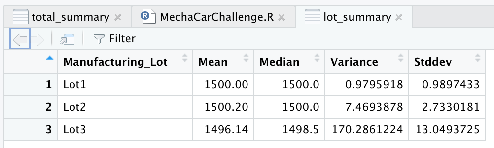
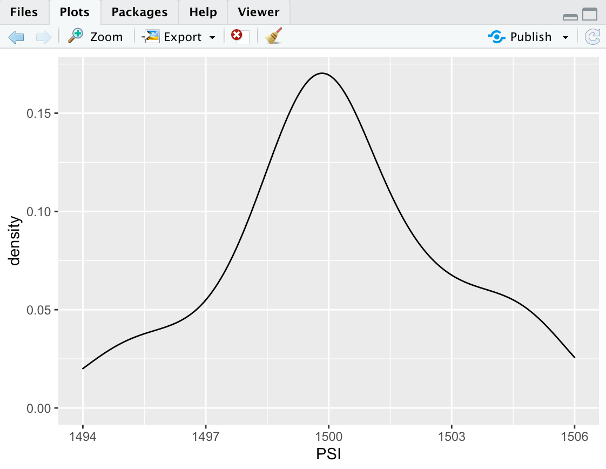

# MechaCar_Statistical_Analysis

# Overview

MechaCar is doing a study for its new cars to predict its fuel efficiency, production effectiveness and competition. This project details the analysis of these key metrics to help management decide on its next steps.

# Results

## Linear Regression to Predict MPG

With the intent of predicting MPG, below is the linear regression based on its attributes.

Some key takeaways:

- Vehicle Weight, spoiler angle and AWD provides a non-random amount of variance to the mpg values.

- With an R squared value of 0.7149 the slope of the linear model cannot be considered to be zero. There is some relationship on the attributes.

- Even though it has the correlation it definetly shows the relation, but to be effective additional attributes would be needed.

## Summary Statistics on Suspension Coils

Below are the summary details of the MechaCar suspension coil capacity.

- It does not look like the current design specifications for the MechaCar suspension coil meets the variance that it should exceed 100 pounds per square inch. 
 - Looking at each lot level, the standard devation for Lot3 alone is above 13 skeweing the metric. The  variance here is also at 170.

## T-Tests on Suspension Coils

Below is the t-test run against an average mean of 1500 PSI (Pounds per Square Inch)

Below is the t-test run against an average mean of 1500 PSI (Pounds per Square Inch) for each Lot seperately

The overall p-value is 0.06028 which is close to a significance value of 0.05. It shows that it is almost similar to the mean with slight deviation.

p value for each lot came as follows:
 - Lot 1: 1
 - Lot 2: 0.6072
 - Lot 3: 0.04168

We can see here clearly for Lot 1 and Lot 2, the p-value is much higher indicating that the means are statistically similar. But for Lot 3 the p value is smaller that a significance level of 0.05 showing its deviation from the mean. 

Plotting the distributions below to show the skewness in Lot 3 compared to Lot 1 and Lot 2.

Lot 1 | Lot 2 | Lot 3 
:----:|:----:|:----:
   |   | 

## Study Design: MechaCar vs Competition

Below are two options to start with the study design

Cost:
 - One metric to study would be cost.
 - Null Hypothesis: Cost is not a factor for consumers purchase cars. Alternative Hypothesis: Cost is a key factor for consumers to purcahse cars.
 - A one sample t-test would be used to check how this metric compares against the mean
 - Car sales with cost. 

Cost per horsepower:
 - Instead of using just cost we can try to derive a metric cost per horsepower to compare against similar cars.
 - Null Hypothesis: Cost per horsepower is not a factor for consumers purchase cars. Alternative Hypothesis: Cost per horsepower is a key factor for consumers to purcahse cars.
 - Multiple linear regression would be used to see data based on multiple attributes.
 - Car sales with cost and horsepower. 

# Summary

The above details provide clear opportunties for some of the key metrics to be looked at. It also provides many areas to continue looking at like safety rating, maintenance cost, car features to have good data to backup the upcoming strategy.